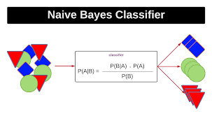
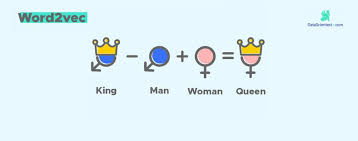
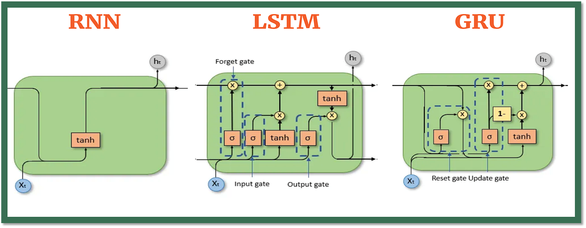
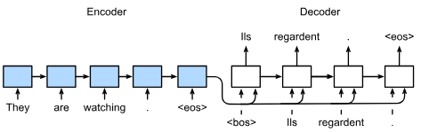

# CEIA - Procesamiento de Lenguaje Natural - Desafíos

Este repositorio fue creado para la resolución de desafíos de la materia `Procesamiento del Lenguaje Natural` de la `Carrera Especialización en Inteligencia Artificial (CEIA)` de la `FIUBA`.

En este encontrarán los siguientes cuatro desafíos:

- [Desafío 1](#desafio-1): En donde se estudian técnicas de clasificación de documentos. Link al [notebook][desafio-01].
- [Desafío 2](#desafio-2): En donde se estudian técnicas de creación de embeddings de palabras. Link al [notebook][desafio-02].
- [Desafío 3](#desafio-3): En donde se crea un modelo de lenguaje basado en caracteres utilizando capas recurrentes y posteriormente se generan secuencias de texto utilizando diversas técnicas. Link al [notebook][desafio-03].
- [Desafío 4](#desafio-4): En donde se crea un modelo traductor de inglés a español **seq2seq**. Link al [notebook][desafio-04].

Pueden encontrar más información sobre los desafíos y el contenido de la materia en [este repositorio][ceia-nlp].

## Desafio 1

En el [desafío 1][desafio-01] se trabaja con el dataset [fetch_20newsgroups][fetch-20-newsgroups] de [scikit-learn][sklearn], el cual contiene documentos correspondientes a **20** diferentes *newsgroups* a fin de realizar tareas de *clasificación* de documentos.

En este caso se estudian:

- **Similitud coseno**: dado un documento elegido al azar, se utiliza la función [cosine_similarity][cosine-similarity] a fin de conocer cuales de los distintos documentos del dataset son los que más se le asemejan.
- **Clasificación por prototipos**: se construye un modelo tipo [zero shot][zero-shot-classification].
- **Clasificación Naïve Bayes**: se entrena un modelo de clasificación [Naïve Bayes][naive-bayes-classifier] a fin de maximizar el desempeño de la clasificación. Se estudian también los modelos [Complement Naïve Bayes][complement-nb] y [Multinomial Naïve Bayes][multinomial-nb].

## Desafio 2

En el [desafío 2][desafio-02] se trabaja con el [song dataset][song-dataset], el cual contiene canciones de distintos artistas en inglés. El objetivo del desafío es buscar grupos de palabras similares entre las distintas canciones de un artista dado.

Para ello, se realizaron los siguientes pasos:

1. Creación de embeddings de palabras mediante [word2vec][word2vec] (modelo de [Gensim][gensim]).
1. Elección de términos al azar, para luego buscar cuáles son su términos más similares y menos similares.
1. Reducción de la dimensionalidad a **2 dimensiones** mediante la función [TSNE][tsne] de [scikit-learn][sklearn].
1. Gráfico de los términos en **2 dimensiones** y análisis de grupos de palabras.

Se estudian técnicas como:

- **Tokenización**: mediante la función [word_tokenize][word_tokenize] se separa un texto en una lista de tokens.
- **Lematización**: utilizando [WordNetLemmatizer][WordNetLemmatizer].
- **Stop words**: permiten filtrar términos que aportan poco valor a un texto.
- **TSNE**: técnica de reducción de dimensionalidad, utilizada para reducir a **2 dimensiones** los embeddings para poder graficarlos y analizar los grupos formados.

## Desafio 3

En el [desafío 3][desafio-03] se entrena un modelo de lenguaje a partir de un texto dado, en este caso, [La Metamorfosis de Frank Kafka][metamorfosis-kafka], con la particularidad que el modelo se crea basado en caracteres, y no en palabras. Posteriormente, se estudian técnicas de generación de texto sobre dicho modelo.

{width=600 height=250}

En particular, se estudian:

- **Capas Recurrentes**: se estudia como trabajan las capas recurrentes en redes neuronales, en particular, [RNN][rnn-layer] (o **SimpleRNN**), [GRU][gru-layer] y [LSTM][lstm-layer] de [Keras][keras].
- **Generación de secuencias texto**: a partir de un modelo basado en caracteres generado con redes neuronales con capas recurrentes, se genera texto con las técnicas de [Greedy search][greedy-search] y [Beam search][beam-search].
- **Perplexity**: se estudia el uso de la métrica de [Perplexity/perplejidad][perplexity] en modelos de lenguajes, la cual permite medir que tan bien un modelo predice una palabra o *la siguiente palabra en una secuencia dada*.

## Desafio 4

En el [desafío 4][desafio-04] se construye un modelo traductor de inglés a español **seq2seq** utilizando una arquitectura **encoder-decoder**. Para ello, se utiliza como base los datos disponibles de [Tatoeba Project][tatoeba-project].

Estos son los pasos realizados a fin de construir y evaluar el modelo:

1. **Tokenización** de los textos de entrada (inglés - encoder) y salida (español - decoder).
1. Creación de **secuencias** de entrada y de salida, dado un largo de secuencia máximo.
1. Preparación de **embeddings** preentrenados para la capa de entrada (inglés - encoder).
1. Creación y entrenamiento de modelos.
1. **Inferencia** (evaluación) y análisis de secuencias.

<!-- URLs desafío 1-->
[sklearn]: https://scikit-learn.org/stable/index.html
[fetch-20-newsgroups]: https://scikit-learn.org/stable/modules/generated/sklearn.datasets.fetch_20newsgroups.html
[cosine-similarity]: https://scikit-learn.org/stable/modules/generated/sklearn.metrics.pairwise.cosine_similarity.html
[zero-shot-classification]: https://huggingface.co/tasks/zero-shot-classification
[naive-bayes-classifier]: https://www.geeksforgeeks.org/machine-learning/naive-bayes-classifiers/
[complement-nb]: https://scikit-learn.org/stable/modules/generated/sklearn.naive_bayes.ComplementNB.html
[multinomial-nb]: https://scikit-learn.org/stable/modules/generated/sklearn.naive_bayes.MultinomialNB.html
<!-- URLs desafío 2-->
[song-dataset]: https://raw.githubusercontent.com/FIUBA-Posgrado-Inteligencia-Artificial/procesamiento_lenguaje_natural/main/datasets/songs_dataset.zip
[word_tokenize]: https://www.nltk.org/api/nltk.tokenize.html#nltk.tokenize.word_tokenize
[WordNetLemmatizer]: https://www.nltk.org/api/nltk.stem.WordNetLemmatizer.html
[word2vec]: https://radimrehurek.com/gensim/models/word2vec.html
[gensim]: https://radimrehurek.com/gensim/index.html
[tsne]: https://scikit-learn.org/stable/modules/generated/sklearn.manifold.TSNE.html
<!-- URLs desafío 3-->
[metamorfosis-kafka]: https://www.textos.info/franz-kafka/la-metamorfosis/ebook
[keras]: https://keras.io/
[lstm-layer]: https://keras.io/api/layers/recurrent_layers/lstm/
[gru-layer]: https://keras.io/api/layers/recurrent_layers/gru/
[rnn-layer]: https://keras.io/api/layers/recurrent_layers/simple_rnn/
[beam-search]: https://www.geeksforgeeks.org/machine-learning/introduction-to-beam-search-algorithm/
[greedy-search]: https://www.geeksforgeeks.org/dsa/greedy-best-first-search-algorithm/
[perplexity]: https://www.geeksforgeeks.org/nlp/perplexity-for-llm-evaluation/
<!-- URLs desafío 4-->
[tatoeba-project]: https://www.manythings.org/anki/
<!-- notebooks -->
[desafio-01]: ./desafios/desafio_01/desafio_01.ipynb
[desafio-02]: ./desafios/desafio_02/desafio_02.ipynb
[desafio-03]: ./desafios/desafio_03/desafio_03.ipynb
[desafio-04]: ./desafios/desafio_04/desafio_04.ipynb
<!-- CEIA - NLP repo -->
[ceia-nlp]: https://github.com/FIUBA-Posgrado-Inteligencia-Artificial/procesamiento_lenguaje_natural
